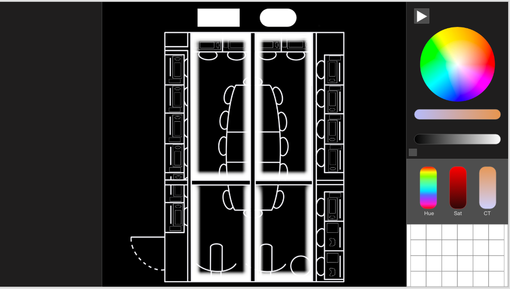
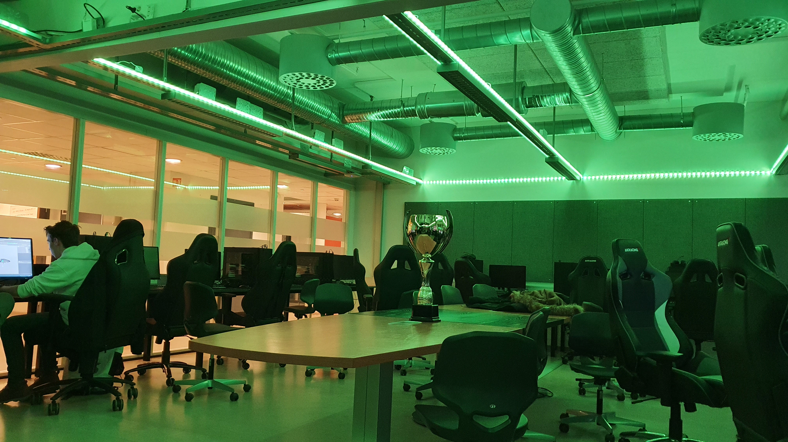

# E-Sport Lightsystem

Light configuration website for the E-sport room at Elvebakken VGS

## Used By

This project is used by the following team(s):

- E-sport Elvebakken

## Setup
To set up and debug the philips hue bridge, please refer to the philips hue developer program

 https://developers.meethue.com/develop/get-started-2/

Get to know the philips hue api used in this project 

 https://developers.meethue.com/develop/hue-api/

## Web preview

## Room preview

## Feedback

If you have any feedback or questions, 
please let us know at: 
- majoa006@osloskolen.no(Outdated)
- kaala003@osloskolen.no(Outdated)
- jasea001@osloskolen.no(Outdated)

## License

This repository is published under the [MIT](https://github.com/Markus-bit/Esport-lys/blob/main/LICENSE) license.
